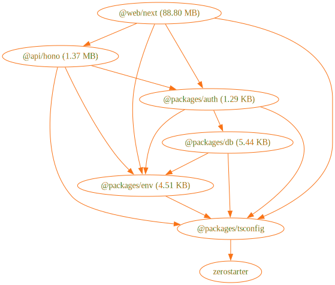
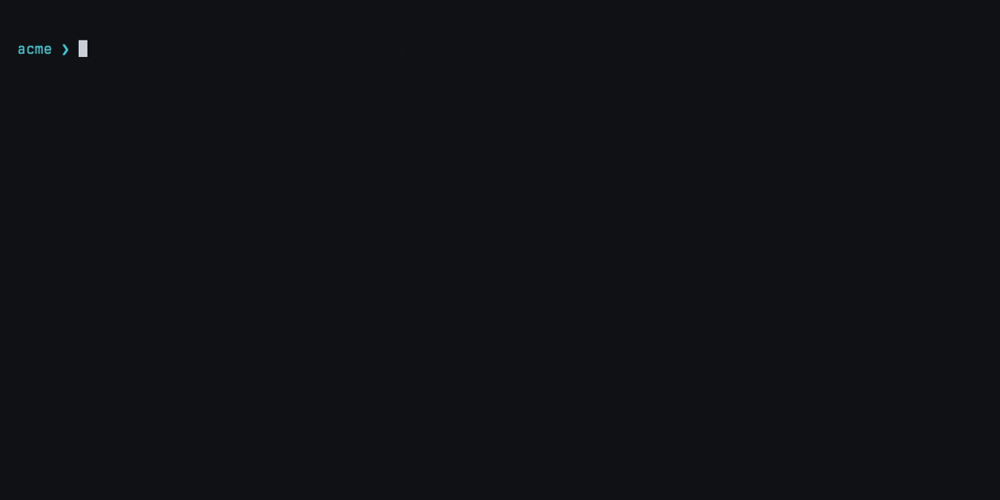

# Awesome Template

[](https://twitter.com/nrjdalal_dev) [](https://github.com/nrjdalal/awesome-templates) [](https://github.com/nrjdalal/awesome-templates)

This template is bootstrapped with script [enterprise-zerostarter.sh](https://github.com/nrjdalal/awesome-templates/blob/main/.github/.scripts/enterprise-zerostarter.sh) and is part of the [awesome-templates](https://github.com/nrjdalal/awesome-templates) repository, to explore a curated collection of up-to-date templates for various projects and frameworks, refreshed every 8 hours.

## Clone this template

```bash
npx gitpick@latest nrjdalal/awesome-templates/tree/main/enterprise-apps/enterprise-zerostarter
```

If you wish to make changes to this template or add your own, please refer to the [contribution guidelines](https://github.com/nrjdalal/awesome-templates?tab=readme-ov-file#contributing).

---

# ZeroStarter

> The SaaS Starter. A modern, type-safe, and high-performance SaaS starter template built as a Bun + Turborepo monorepo.

- **📚 Documentation**: [zerostarter.dev/docs](https://zerostarter.dev/docs)
- **🤖 AI / LLMs**: [zerostarter.dev/llms.txt](https://zerostarter.dev/llms.txt)
- **🐦 X**: [@nrjdalal](https://x.com/nrjdalal)
- **💬 Discord**: [Join the community](https://discord.gg/38FeAUmHSZ)

> ZeroStarter is stable and production-ready. We're actively adding new features and integrations day-by-day.

## ⚙️ Architecture and Tech Stack

> [!NOTE]
> For a deeper dive, see the [Architecture documentation](https://zerostarter.dev/docs/getting-started/architecture).



Every item below is wired and working out of the box, not just a dependency in `package.json`.

- **Runtime & Build**: [Bun](https://bun.sh) (runtime and package manager) with [Turborepo](https://turbo.build) for caching and task orchestration
- **Frontend**: [Next.js 16](https://nextjs.org) (App Router, Turbopack) with [React 19](https://react.dev)
- **Styling & UI**: [Tailwind CSS v4](https://tailwindcss.com) and [shadcn/ui](https://ui.shadcn.com) on [Base UI](https://base-ui.com) primitives
- **Backend**: [Hono](https://hono.dev) with OpenAPI and an interactive [Scalar](https://scalar.com) reference at `/api/docs`
- **Type-Safe RPC**: [Hono Client](https://hono.dev/docs/guides/rpc) for end-to-end types from the backend to the frontend
- **Database**: [PostgreSQL](https://www.postgresql.org) with [Drizzle ORM](https://orm.drizzle.team) and migrations
- **Authentication**: [Better Auth](https://better-auth.com) with GitHub and Google OAuth, organizations, and teams
- **Authorization**: a role-gated admin console at `/console`, backed by the Better Auth admin plugin
- **Rate Limiting**: [hono-rate-limiter](https://www.npmjs.com/package/hono-rate-limiter) keyed per user, API key, or IP (with [Arcjet](https://arcjet.com) IP detection)
- **Data & Forms**: [TanStack Query](https://tanstack.com/query) for server state and [TanStack Form](https://tanstack.com/form) for forms
- **Validation**: [Zod](https://zod.dev), shared across the API and forms
- **Analytics**: [PostHog](https://posthog.com) for product analytics, feature flags, and session replay
- **Documentation**: [Fumadocs](https://fumadocs.dev) with full-text search and auto-generated [llms.txt](https://zerostarter.dev/llms.txt)
- **Dynamic OG Images**: [takumi](https://www.npmjs.com/package/takumi-js) for home, docs, and blog social cards
- **SEO**: sitemap, robots, and per-page metadata, indexable by default
- **Tooling**: [Oxlint](https://oxc.rs) and [Oxfmt](https://oxc.rs) with [Lefthook](https://github.com/evilmartians/lefthook) git hooks and [Commitlint](https://commitlint.js.org)
- **Automated Releases**: changelog generation and a canary-to-main release flow

## 📂 Monorepo Structure

```
.
├── api/
│   └── hono/      # Backend API (Hono): /api/v1, /api/auth, /api/agents, /api/docs
├── web/
│   └── next/      # Frontend (Next.js App Router): dashboard, admin console, docs, blog
└── packages/
    ├── auth/      # Better Auth instance (OAuth, organizations, teams, admin)
    ├── db/        # Drizzle ORM schema and PostgreSQL client
    ├── env/       # Type-safe environment variables (t3-oss/env + Zod)
    └── config/    # Shared config: TS/tsdown bases and the `site` brand identity
```

Two deployable apps (`api/hono` and `web/next`) and four shared packages. Brand identity lives in one place, `@packages/config/site`, so a fork rebrands by editing a single file.

📖 **[Full project structure →](https://zerostarter.dev/docs/getting-started/project-structure)**

## 🔌 Type-Safe API Client

> [!NOTE]
> For details and examples, see the [Type-Safe API documentation](https://zerostarter.dev/docs/getting-started/type-safe-api).

ZeroStarter uses [Hono RPC](https://hono.dev/docs/guides/rpc) for end-to-end type safety between the backend and frontend.

- **Backend**: routes in `api/hono/src/routers` are exported as `AppType` from `@api/hono`.
- **Frontend**: the client at `web/next/src/lib/api/client.ts` infers request and response types from `AppType`.
- **API Docs**: an interactive reference is served at `/api/docs` (OpenAPI spec at `/api/openapi.json`).

```ts
import { apiClient, unwrap } from "@/lib/api/client"

// Fully typed { data, error } result (never throws)
const { data, error } = await unwrap(apiClient.health.$get())
```

## 🔥 Why ZeroStarter?

- **End-to-end type safety**: one type flows from the database through the API to the frontend, so breaking changes fail at compile time, not in production.
- **Modular by design**: shared packages for auth, database, env, and config that you can swap or extend without fighting the system.
- **Production-ready**: Docker and Vercel configs, migrations on deploy, rate limiting, and SEO are set up from the first commit.
- **Forkable**: brand identity is centralized in `@packages/config/site`, so making it your own is a one-file change.

📖 **[Read more →](https://zerostarter.dev)**

## 🚀 Quick Start

<p align="center">
  
</p>

```bash
# In a new, empty directory (its name becomes your project name):
# scaffold a fresh product from ZeroStarter (fetches, rebrands, installs)
npx zerostarter@latest init

# Configure environment (see .env.example for what's required)
cp .env.example .env

# Set up the database
bun run db:generate
bun run db:migrate

# Start the dev servers (web on :3000, api on :4000)
bun dev
```

You will need a PostgreSQL database and GitHub plus Google OAuth credentials. PostHog analytics and user feedback are optional.

📖 **[Complete setup guide →](https://zerostarter.dev/docs/getting-started/setup)**

## 📜 Scripts

| Command                           | Description                                 |
| --------------------------------- | ------------------------------------------- |
| `bun dev`                         | Start the api and web dev servers           |
| `bun run build`                   | Build every workspace                       |
| `bun run check-types`             | Type-check every workspace                  |
| `bun run lint` / `bun run format` | Lint with Oxlint / format with Oxfmt        |
| `bun run db:generate`             | Generate Drizzle migrations from the schema |
| `bun run db:migrate`              | Apply pending migrations                    |
| `bun run db:studio`               | Open Drizzle Studio                         |
| `bun run console:roles`           | Grant, revoke, or list admin console access |
| `bun run shadcn:update`           | Update shadcn/ui components                 |

📖 **[All scripts →](https://zerostarter.dev/docs/getting-started/scripts)**

## 📚 Documentation

- **[Getting Started](https://zerostarter.dev/docs)**: introduction, architecture, and project structure
- **[Authentication & Organizations](https://zerostarter.dev/docs/manage/authentication)**: OAuth, orgs, teams, and roles
- **[Type-Safe API](https://zerostarter.dev/docs/getting-started/type-safe-api)**: the Hono RPC client
- **[Database](https://zerostarter.dev/docs/manage/database)**: schema and migrations
- **[Environment Variables](https://zerostarter.dev/docs/manage/environment)**: configuration
- **[Deployment](https://zerostarter.dev/docs/deployment/vercel)**: Vercel and Docker
- **[AI / LLMs](https://zerostarter.dev/llms.txt)**: optimized documentation

## 🚢 Deployment

ZeroStarter ships as two deployable apps that share one PostgreSQL database.

- **Vercel**: deploy `web/next` and `api/hono` as separate projects. The API runs pending migrations on deploy.
- **Docker**: `docker compose up` builds and runs both apps from the included multi-stage Dockerfiles.

📖 **[Deployment guides →](https://zerostarter.dev/docs/deployment/vercel)**

## 🤝 Contributing

Contributions are welcome. Please read the [contributing guide](https://zerostarter.dev/docs/contributing) first.

## ❤️ Contributors

<a href="https://github.com/nrjdalal/zerostarter/graphs/contributors">
  
</a>

## 📄 License

MIT License. See [LICENSE.md](LICENSE.md) for details.

---

**⭐ Star this repo** if it helps, and follow [@nrjdalal](https://x.com/nrjdalal) for updates.

<!-- trigger build: 7 -->
