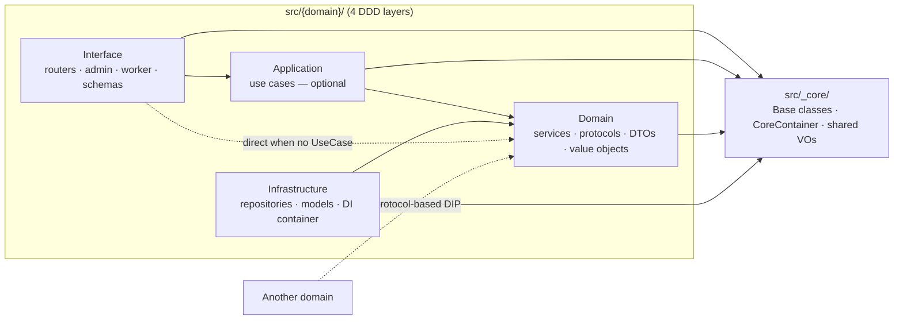
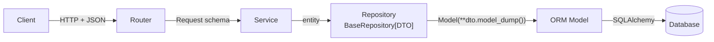

# Awesome Template

[](https://twitter.com/nrjdalal_dev) [](https://github.com/nrjdalal/awesome-templates) [](https://github.com/nrjdalal/awesome-templates)

This template is bootstrapped with script [fastapi-agent-blueprint.sh](https://github.com/nrjdalal/awesome-templates/blob/main/.github/.scripts/fastapi-agent-blueprint.sh) and is part of the [awesome-templates](https://github.com/nrjdalal/awesome-templates) repository, to explore a curated collection of up-to-date templates for various projects and frameworks, refreshed every 8 hours.

## Clone this template

```bash
npx gitpick@latest nrjdalal/awesome-templates/tree/main/fastapi-apps/fastapi-agent-blueprint
```

If you wish to make changes to this template or add your own, please refer to the [contribution guidelines](https://github.com/nrjdalal/awesome-templates?tab=readme-ov-file#contributing).

---

<p align="center">
  <picture>
    <source media="(prefers-color-scheme: dark)" srcset="docs/assets/logo-dark.png">
    <source media="(prefers-color-scheme: light)" srcset="docs/assets/logo-light.png">
    
  </picture>
</p>

<h1 align="center">FastAPI Agent Blueprint</h1>

<p align="center">
  <a href="https://github.com/Mr-DooSun/fastapi-agent-blueprint/actions/workflows/ci.yml"></a>
  <a href="https://www.python.org/downloads/"></a>
  <a href="https://fastapi.tiangolo.com"></a>
  <a href="LICENSE"></a>
  <a href="https://github.com/astral-sh/ruff"></a>
  <a href="https://github.com/Mr-DooSun/fastapi-agent-blueprint/stargazers"></a>
</p>

<p align="center">
  <b>FastAPI backend blueprint for AI agent applications.</b><br>
  DDD domains · SQLAlchemy/Alembic · Taskiq workers · admin UI · RAG infrastructure · Claude/Codex collaboration harness.
</p>

<p align="center">
  <a href="#try-it-in-60-seconds">60s Quickstart</a>
  · <a href="#why-this-blueprint">Why</a>
  · <a href="#ai-collaboration-harness">AI Collaboration</a>
  · <a href="#how-it-compares">Comparison</a>
  · <a href="#architecture-at-a-glance">Architecture</a>
  · <a href="docs/README.ko.md">한국어</a>
</p>

<p align="center">
  <a href="https://github.com/Mr-DooSun/fastapi-agent-blueprint/generate">
    
  </a>
</p>

---

## Try it in 60 seconds

No Docker, no PostgreSQL, no cloud credentials — SQLite + in-memory broker.

```bash
git clone https://github.com/Mr-DooSun/fastapi-agent-blueprint.git
cd fastapi-agent-blueprint
make setup        # one-time: venv + deps via uv
make quickstart   # FastAPI on :8001, SQLite schema auto-created
```

In a second terminal, `make demo` exercises the `auth` + `user` domains
(JWT register → CRUD → refresh → logout) and `make demo-rag` exercises the
`docs` domain (end-to-end RAG: upload → chunk → embed → retrieve → answer
with citations, zero credentials):

```text
→ Health check
{ "status": "ok" }

→ Register
{ "success": true, "data": { "accessToken": "...", "refreshToken": "..." } }

→ Create a user
{ "success": true, "data": { "id": 2, "username": "bob", ... } }

→ List users (page=1, pageSize=10)
{ "data": [ { "id": 1, "username": "alice" }, { "id": 2, "username": "bob" } ],
  "pagination": { "currentPage": 1, "totalItems": 2, "hasNext": false } }

→ Update the user    → Delete the user
→ Refresh token      → Logout
→ Done. API docs: http://127.0.0.1:8001/docs
```

- API docs: <http://127.0.0.1:8001/docs> (Stoplight Elements & Scalar recommended; spec download + frontend handoff link on the same page)
- Admin UI: <http://127.0.0.1:8001/admin> (`admin` / `admin`)
- Full walkthrough: [`docs/quickstart.md`](docs/quickstart.md)
- Frontend handoff: [`docs/frontend-handoff.md`](docs/frontend-handoff.md)
- Real dev stack (PostgreSQL + migrations): [`docs/reference.md`](docs/reference.md#local-development-with-postgresql)

---

## Platform in action

Clone → quickstart → CRUD → JWT auth → background worker → RAG query:

```bash
make quickstart && make demo && make demo-rag
```


Full integration walkthrough (auth · RBAC · worker · admin · RAG · OTEL): [`docs/canonical-demo.md`](docs/canonical-demo.md)

---

## Why this blueprint

<table>
<tr>
<td width="60%" valign="top">

**Production rigor**

- **DDD layers (4-tier)** — Interface · Domain · Infrastructure · Application, enforced by pre-commit import guard
- **Zero-boilerplate CRUD** — 8 async methods via `BaseService` + `BaseRepository`, paginated list with `QueryFilter` included
- **Auto domain discovery** — drop a folder into `src/{name}/`, it auto-registers. No container edits, no bootstrap edits
- **Agent backend surfaces** — REST API, async worker, admin UI, and a planned MCP interface over the same domain logic
- **Pluggable infra** — PostgreSQL / MySQL / SQLite · DynamoDB · S3 / MinIO · S3 Vectors · SQS / RabbitMQ · OpenAI / Bedrock
- **OpenTelemetry** — `[otel]` extra, `OTEL_ENABLED` env flag, Jaeger/Tempo/Phoenix recipe
- **JWT + RBAC** — HS256 auth domain, DB-backed refresh rotation, `User.role` admin gating
- **AI Usage Ledger** — per-call LLM accounting, `ai_usage` domain, admin + API surfaces
- **Taskiq smart retry** — task-scoped structured logging, permanent-aware retry policy
- **Frontend handoff** — OpenAPI download, Bruno/Postman/Hey API/Orval recipes, JWT flow, camelCase contract ([`docs/frontend-handoff.md`](docs/frontend-handoff.md))

</td>
<td width="40%" valign="top">

**AI-assisted acceleration**

- **Claude/Codex collaboration harness** — shared `AGENTS.md`, mirrored skills, and hook-backed workflow reminders
- `/new-domain order` or `$new-domain order` scaffolds **44 files** (15 source + 25 `__init__.py` + 4 tests) in one command
- **14 Claude Code + 14 Codex CLI skills** sharing the same architecture and review rules
- **AI-assisted development (AIDD)** — humans keep product judgment; agents follow repeatable domain, test, review, and drift-check workflows
- Full setup: [`docs/ai-development.md`](docs/ai-development.md)
- Manual path: [`docs/tutorial/first-domain.md`](docs/tutorial/first-domain.md) (Path B)


> Works as a normal FastAPI blueprint. With Claude Code or Codex CLI, the same production workflow becomes AI-assisted and repeatable.

</td>
</tr>
</table>

---

## AI collaboration harness

Most templates stop at generated files. This blueprint also ships the
collaboration layer that keeps AI coding agents useful after the first
scaffold:

- **Shared source of truth** — `AGENTS.md` defines the architecture, DTO rules, logging rules, security constraints, and default coding flow.
- **Claude Code + Codex parity** — tool-specific harnesses point back to the same shared rules instead of drifting into separate playbooks.
- **Repo-local skills** — domain scaffolding, API work, admin pages, worker tasks, migrations, tests, architecture review, security review, and guideline sync.
- **Governed changes** — pre-commit checks, import guards, language policy, and review workflows catch architecture drift before it becomes team debt.

The result is a backend starter that can be used by hand, then accelerated by
AI tools without asking every contributor to remember the whole architecture
from scratch.

---

## How it compares

| Feature | FastAPI Agent Blueprint | [tiangolo/full-stack](https://github.com/fastapi/full-stack-fastapi-template) | [s3rius/template](https://github.com/s3rius/FastAPI-template) | [teamhide/boilerplate](https://github.com/teamhide/fastapi-boilerplate) |
|---|:-:|:-:|:-:|:-:|
| Zero-boilerplate CRUD (8 methods) | **Yes** | No | No | No |
| Auto domain discovery | **Yes** | No | No | No |
| Architecture enforcement (pre-commit) | **Yes** | No | No | No |
| AI workflow skills (Claude + Codex) | **14 + 14** | 0 | 0 | 0 |
| Vector infrastructure (S3 Vectors) | **Yes** | No | No | No |
| Multi-interface (API + Worker + Admin + MCP) | **3 + 1 planned** | 2 | 1 | 1 |
| Architecture Decision Records | **18 active · 30 archived** | 0 | 0 | 0 |
| Type-safe generics across layers | **Yes** | Partial | Partial | No |
| IoC container DI | **Yes** | No | No | No |

Full comparison including Litestar, Robyn, cookiecutter, and adoption paths: [`docs/comparison.md`](docs/comparison.md)

---

## AI use case: document QA (`src/docs/`)

The blueprint ships a worked RAG example — upload documents, ask questions,
get structured answers with citations. It proves the building blocks
(vectors, embeddings, LLM agent, worker, admin) compose end-to-end.

```bash
make quickstart   # terminal 1
make demo-rag     # terminal 2 — seeds 3 docs, runs a query
```

```text
POST /v1/docs/documents   # chunk → embed → upsert
POST /v1/docs/query       # embed question → top-k retrieval → agent answer
GET  /admin/docs          # browse + query playground
```

Under the hood, the RAG orchestration is a **reusable `_core` pattern**
([ADR 040](docs/history/040-rag-as-reusable-pattern.md)), not a domain.
`src/docs/` is one consumer; future AI domains (`support_bot`, `product_qa`)
inject the same `RagPipeline` instead of duplicating chunking + retrieval
code:

```python
# src/_core/domain/services/rag_pipeline.py
class RagPipeline(Generic[TChunk]):
    async def answer(self, question, top_k=5, filters=None) -> tuple[QueryAnswer, list[TChunk]]:
        ...  # embed → vector_store.search → answer_agent.answer
```

Zero-config path uses a **stub embedder** (keyword bag-of-words) and **stub
answer agent** (templated response from retrieved chunks), both in
`src/_core/infrastructure/rag/`. Set `EMBEDDING_PROVIDER` + `LLM_PROVIDER`
in `.env` to swap in real providers — the pipeline is the same.

---

## Architecture at a glance

Every domain under `src/{domain}/` has four DDD layers. Arrows mean
**"depends on"**. `Application` (use cases) is optional — the dotted
line is the common path for simple CRUD (Router → Service directly).



| Layer | Role | Base class |
|---|---|---|
| Interface | Router · Request/Response · Admin · Worker task | — |
| Domain | Service · Protocol · DTO · Exceptions | `BaseService[CreateDTO, UpdateDTO, ReturnDTO]` |
| Infrastructure | Repository · Model · DI container | `BaseRepository[ReturnDTO]` |
| Application | UseCase — optional orchestrator | — |

> Full set of diagrams (Layer · Write · Read) plus RDB / DynamoDB / S3
> Vectors variants lives in
> [`docs/ai/shared/architecture-diagrams.md`](docs/ai/shared/architecture-diagrams.md).
> Non-Mermaid viewers:
> [SVG exports](docs/assets/architecture/).

### Data flow — Write (`POST` / `PUT` / `DELETE`)



- **Request → Service** directly when fields match (no intermediate DTO — [ADR 004](docs/history/004-dto-entity-responsibility.md)).
- **Model ↔ DTO** conversion happens *only* inside the Repository.
- Read flow is the mirror image; the Router strips sensitive fields on the way out.

### Storage variants

Same flow, different base classes:

| Storage | Service base | Repository / Store base | List return |
|---|---|---|---|
| RDB (default) | `BaseService[Create, Update, DTO]` | `BaseRepository[DTO]` | `(list[DTO], PaginationInfo)` |
| DynamoDB | `BaseDynamoService[…]` | `BaseDynamoRepository[DTO]` | `CursorPage[DTO]` |
| S3 Vectors | domain-specific | `BaseS3VectorStore[DTO]` | `VectorSearchResult[DTO]` |

---

## Interfaces

One business logic, multiple surfaces:

| Interface | Tech | Status | Purpose |
|---|---|---|---|
| HTTP API | FastAPI | Stable | REST endpoints |
| Async worker | Taskiq + SQS / RabbitMQ / InMemory | Stable | Background jobs |
| Admin UI | NiceGUI | Stable | Auto-generated admin CRUD |
| MCP server | FastMCP | Planned ([#18](https://github.com/Mr-DooSun/fastapi-agent-blueprint/issues/18)) | AI agent tool interface |

---

## Learn more

| I want to… | Read |
|---|---|
| Spin it up and poke around | [`docs/quickstart.md`](docs/quickstart.md) |
| See everything work end-to-end (auth · RBAC · worker · RAG · OTEL) | [`docs/canonical-demo.md`](docs/canonical-demo.md) |
| Build a real domain, end-to-end | [`docs/tutorial/first-domain.md`](docs/tutorial/first-domain.md) |
| See small, pattern-focused example apps | [`examples/`](examples/) |
| Understand the architecture in depth | [`docs/ai/shared/architecture-diagrams.md`](docs/ai/shared/architecture-diagrams.md) · [`AGENTS.md`](AGENTS.md) |
| Set up Claude Code or Codex CLI | [`docs/ai-development.md`](docs/ai-development.md) |
| Add a domain by hand (no AI tools) | [`docs/tutorial/first-domain.md`](docs/tutorial/first-domain.md) (Path B) |
| Adopt into an existing FastAPI project | [`docs/adoption.md`](docs/adoption.md) |
| Check Python / FastAPI / tool version support | [`docs/compatibility.md`](docs/compatibility.md) |
| See detailed env vars, tech stack, project tree | [`docs/reference.md`](docs/reference.md) |
| Understand why a decision was made | [ADR index](docs/history/README.md) (18 active · 30 archived) |
| Follow what's next | [Roadmap](docs/reference.md#roadmap) · [issue tracker](https://github.com/Mr-DooSun/fastapi-agent-blueprint/issues) |

---

## Roadmap

- **MCP server interface** — expose domain services as agent tools via FastMCP ([#18](https://github.com/Mr-DooSun/fastapi-agent-blueprint/issues/18))
- **pgvector** — additional vector backend alongside S3 Vectors ([#11](https://github.com/Mr-DooSun/fastapi-agent-blueprint/issues/11))

See [full roadmap](docs/reference.md#roadmap) · [open issues](https://github.com/Mr-DooSun/fastapi-agent-blueprint/issues)

---

## Contributing

See [`CONTRIBUTING.md`](CONTRIBUTING.md) for dev setup, coding guidelines,
and the PR workflow. Newcomers — check the
[`good first issue`](https://github.com/Mr-DooSun/fastapi-agent-blueprint/issues?q=is%3Aopen+label%3A%22good+first+issue%22)
label; the small apps tracked under [`examples/`](examples/) are a
low-friction place to land your first PR.

## License

[MIT](LICENSE) — free for commercial use, modification, and distribution.

---

<p align="center">
<a href="https://star-history.com/#Mr-DooSun/fastapi-agent-blueprint&Date">
  <picture>
    <source media="(prefers-color-scheme: dark)" srcset="https://api.star-history.com/svg?repos=Mr-DooSun/fastapi-agent-blueprint&type=Date&theme=dark" />
    <source media="(prefers-color-scheme: light)" srcset="https://api.star-history.com/svg?repos=Mr-DooSun/fastapi-agent-blueprint&type=Date" />
    
  </picture>
</a>
</p>
