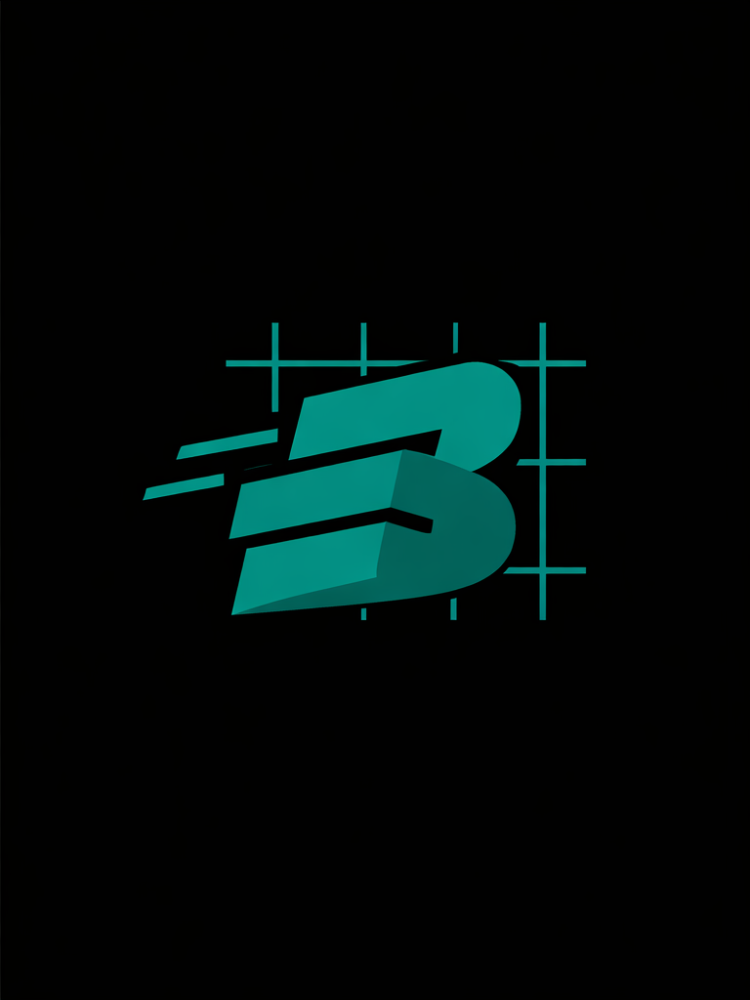
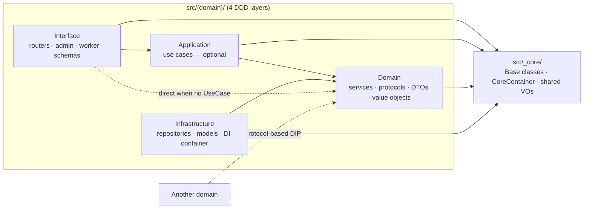

# Awesome Template

[](https://twitter.com/nrjdalal_dev) [](https://github.com/nrjdalal/awesome-templates) [](https://github.com/nrjdalal/awesome-templates)

This template is bootstrapped with script [fastapi-agent-blueprint.sh](https://github.com/nrjdalal/awesome-templates/blob/main/.github/.scripts/fastapi-agent-blueprint.sh) and is part of the [awesome-templates](https://github.com/nrjdalal/awesome-templates) repository, to explore a curated collection of up-to-date templates for various projects and frameworks, refreshed every 8 hours.

## Clone this template

```bash
npx gitpick@latest nrjdalal/awesome-templates/tree/main/fastapi-apps/fastapi-agent-blueprint
```

If you wish to make changes to this template or add your own, please refer to the [contribution guidelines](https://github.com/nrjdalal/awesome-templates?tab=readme-ov-file#contributing).

---

<p align="center">
  <picture>
    <source media="(prefers-color-scheme: dark)" srcset="docs/assets/logo-dark.png">
    <source media="(prefers-color-scheme: light)" srcset="docs/assets/logo-light.png">
    
  </picture>
</p>

<h1 align="center">FastAPI Agent Blueprint</h1>

<p align="center">
  <a href="https://github.com/Mr-DooSun/fastapi-agent-blueprint/actions/workflows/ci.yml"></a>
  <a href="https://www.python.org/downloads/"></a>
  <a href="https://fastapi.tiangolo.com"></a>
  <a href="LICENSE"></a>
  <a href="https://github.com/astral-sh/ruff"></a>
  <a href="https://github.com/Mr-DooSun/fastapi-agent-blueprint/stargazers"></a>
</p>

<p align="center">
  <b>A FastAPI backend blueprint for teams building with AI coding agents.</b><br>
  A modular backend to run your application. A shared collaboration harness to guide how your team develops it.
</p>

<p align="center">
  <a href="#quickstart">Run the backend</a>
  · <a href="#ai-collaboration-harness">Explore the harness</a>
  · <a href="#why-this-blueprint">Is it a fit?</a>
  · <a href="docs/README.ko.md">한국어</a>
</p>

<p align="center">
  <a href="https://github.com/Mr-DooSun/fastapi-agent-blueprint/generate">
    
  </a>
</p>

| Backend foundation | AI collaboration harness |
|---|---|
| Domain logic shared by HTTP APIs, background tasks, and an admin UI. Optional AI and infrastructure adapters let you start locally and add services as needed. | Repository rules, task-specific skills, hooks, and review procedures guide changes to that backend across Claude Code, Codex, and Antigravity. |
| [Run it locally](#quickstart) · [See the architecture](#architecture-at-a-glance) | [Follow an API change](#ai-collaboration-harness) · [Read the shared workflow](docs/ai/shared/target-operating-model.md) |

## Why this blueprint

Use it when you need multiple business domains, API + worker + admin surfaces,
or a shared development workflow for teammates using AI coding tools. The
backend and harness are designed together: the harness references this repo's
layering, contracts, and verification commands.

Budget time to learn the domain layout, dependency-injector containers, and
plan/review workflow. A small single-purpose API may not need that structure;
a project needing a bundled customer frontend needs a different starting point.
The harness is repository-specific, not a standalone drop-in package.

You can develop without AI tools using the [manual domain tutorial](docs/tutorial/first-domain.md).
For incremental adoption and trade-offs, see the [adoption guide](docs/adoption.md)
and [selection guide](docs/comparison.md).

<a id="try-it-in-60-seconds"></a>

## Quickstart

Prerequisites: Python **>=3.12.9**, [uv](https://docs.astral.sh/uv/), Git, and
`make`. The demos also use `curl` and `python3` on your PATH.
No Docker, PostgreSQL, cloud credentials, or AI coding tool required.

**Terminal 1 — start the backend:**

```bash
git clone https://github.com/Mr-DooSun/fastapi-agent-blueprint.git
cd fastapi-agent-blueprint
make quickstart
```

This installs the quickstart dependencies, creates a SQLite database, and keeps
the server running on port 8001. Use a fresh checkout for evaluation:
`quickstart` syncs the admin extra and can remove other installed extras.
For development dependencies and commit hooks, use `make setup` when moving to
the [development setup](docs/reference.md#local-development-with-postgresql).

**Terminal 2 — from the same repository directory:**

```bash
make demo       # JWT auth, admin-realm login, user CRUD, refresh and logout
make demo-rag   # document upload, retrieval and an answer with citations
```

Keep terminal 1 running. Both demos check their API responses and report failure
if a request does not succeed. The default RAG demo uses a keyword-based stub
embedder and a templated stub answer agent; it demonstrates the pipeline without
calling an external model.

- [API docs](http://127.0.0.1:8001/docs) — browse the API or download its OpenAPI spec.
- [Admin UI](http://127.0.0.1:8001/admin) — evaluation bootstrap login: `admin` / `admin`.
- [Quickstart details](docs/quickstart.md) · [Full integration walkthrough](docs/canonical-demo.md).

These defaults are for local evaluation. Follow the development and deployment
guides before using real data or exposing the service.

<a id="platform-in-action"></a>

<!-- Regenerate with `make demo-gif` whenever scripts/demo.sh changes. -->


## Backend foundation

| Capability | What it provides |
|---|---|
| Domain structure | Router → Service → Repository, with an optional UseCase for orchestration; automatic domain registration and reusable CRUD base classes. |
| API, worker, admin | FastAPI endpoints, Taskiq background tasks, and NiceGUI admin pages consuming domain services. |
| Optional infrastructure | SQL databases, DynamoDB, object storage, vector storage, and AI providers behind adapters and configuration. Start with SQLite + InMemory. |
| Operations | JWT/RBAC, structured logging, opt-in OpenTelemetry, AI usage accounting, and error notifications. |

<a id="ai-use-case-document-qa-srcdocs"></a>

### Worked example: document QA

The `docs` domain composes document upload, chunking, embedding, retrieval, and
answers with citations. Its shared RAG pipeline can be reused by other domains
([ADR 040](docs/history/040-rag-as-reusable-pattern.md)).

For real model calls, install the `pydantic-ai` extra, configure
`EMBEDDING_PROVIDER` + `EMBEDDING_MODEL` and `LLM_PROVIDER` + `LLM_MODEL`, and
supply the selected providers' credentials. See the
[configuration reference](docs/reference.md) for optional extras and settings;
the [RAG walkthrough](docs/canonical-demo.md) shows the flow.

<a id="interfaces"></a>

HTTP, worker, and admin interfaces are implemented. The MCP server interface
is [planned](https://github.com/Mr-DooSun/fastapi-agent-blueprint/issues/18), not
part of the runnable backend today.

## AI collaboration harness

The harness helps contributors work within the same backend conventions:

| Capability | What it provides |
|---|---|
| Shared rules | `AGENTS.md` and shared references define architecture, contracts, security constraints, and the development workflow. |
| Task-specific skills | Guides for domains, APIs, worker tasks, admin pages, migrations, testing, review, and documentation sync. |
| Workflow boundaries | Planning and execution are separate steps. Scope changes, missing verification, and completion checks have explicit handling. |
| Checks and review | Commit/CI checks inspect deterministic rules; reviews assess behavior, architectural fit, and documentation drift. |

### Worked example: add an API to an existing domain

For a request such as “add a filtered list endpoint to the order domain,” the
workflow is:

| Step | Contributor and agent actions |
|---|---|
| Frame and plan | Clarify the contract and affected layers with `/plan-feature` (Claude) or `$plan-feature` (Codex). Review the resulting execution packet. |
| Start execution | The contributor explicitly invokes `/execute-plan` or `$execute-plan` with that packet. The executor routes API implementation through the `add-api` skill. |
| Implement and verify | Reuse the existing layer patterns, add relevant tests, and run the packet's verification commands. Surface unplanned capability gaps before expanding the work. |
| Review and sync | Review the diff; reconcile affected documentation with `sync-guidelines` when needed. Record verification and any unresolved items before PR completion. |

This is an illustrative workflow, not a command that runs every step
automatically. Human decisions remain part of the process.

**What is enforced?** Configured pre-commit/CI checks block detected violations
such as prohibited imports, broken documentation links, or shared-file language
policy failures. Workflow reminders are advisory in many cases. For example,
the plan-to-execution gate blocks matching source edits in Claude, while Codex
receives a Stop-time advisory. Tool adapters share policy but do not provide
identical enforcement. See the [operating model](docs/ai/shared/target-operating-model.md)
for current coverage and exceptions.

Domain scaffolding is another supported task:


[Set up Claude Code or Codex](docs/ai-development.md) ·
[Antigravity harness](.antigravity/rules/project-harness.md) ·
[Shared rules](AGENTS.md) ·
[Manual development path](docs/tutorial/first-domain.md)

## Architecture at a glance

Every domain separates Interface, Domain, Infrastructure, and optional
Application code. Runtime CRUD follows Router → Service → Repository;
dependency arrows below describe imports, not request execution order.


```mermaid
flowchart LR
    subgraph domain["src/{domain}/  (4 DDD layers)"]
        I["Interface<br/>routers · admin · worker · schemas"]
        A["Application<br/>use cases — optional"]
        D["Domain<br/>services · protocols · DTOs · value objects"]
        Inf["Infrastructure<br/>repositories · models · DI container"]
        I --> A
        A --> D
        Inf --> D
        I -. direct when no UseCase .-> D
    end

    Core["src/_core/<br/>Base classes · CoreContainer · shared VOs"]
    I --> Core
    A --> Core
    D --> Core
    Inf --> Core

    Other["Another domain"] -. via Protocol-based DIP .-> D
```

<a id="data-flow--write-post--put--delete"></a>
<a id="storage-variants"></a>

Request schemas can pass directly to services when fields match. Model-to-DTO
conversion belongs in repositories. Detailed write/read flows and storage
variants are in the [architecture guide](docs/ai/shared/architecture-diagrams.md)
([SVG versions](docs/assets/architecture/)).

<a id="how-it-compares"></a>

## Learn more

| Backend development | AI collaboration |
|---|---|
| [Quickstart](docs/quickstart.md) · [Integration walkthrough](docs/canonical-demo.md) | [Tool setup](docs/ai-development.md) · [Antigravity](.antigravity/rules/project-harness.md) |
| [First domain tutorial](docs/tutorial/first-domain.md) · [Examples](examples/) | [Shared rules](AGENTS.md) · [Workflow and exceptions](docs/ai/shared/target-operating-model.md) |
| [Adoption paths](docs/adoption.md) · [Selection trade-offs](docs/comparison.md) | [Design decisions](docs/history/README.md) |
| [Configuration](docs/reference.md) · [Compatibility](docs/compatibility.md) · [Frontend handoff](docs/frontend-handoff.md) | [Contribution and review workflow](CONTRIBUTING.md) |

## Roadmap

- [MCP server interface](https://github.com/Mr-DooSun/fastapi-agent-blueprint/issues/18).
- [pgvector backend](https://github.com/Mr-DooSun/fastapi-agent-blueprint/issues/11).

See the [full roadmap](docs/reference.md#roadmap) and
[issue tracker](https://github.com/Mr-DooSun/fastapi-agent-blueprint/issues).

## Contributing

See [CONTRIBUTING.md](CONTRIBUTING.md) for setup and the PR workflow.
The [examples](examples/) and
[good first issues](https://github.com/Mr-DooSun/fastapi-agent-blueprint/issues?q=is%3Aopen+label%3A%22good+first+issue%22)
are entry points for new contributors.

## License

[MIT](LICENSE) — free for commercial use, modification, and distribution.

---

<p align="center">
<a href="https://star-history.com/#Mr-DooSun/fastapi-agent-blueprint&Date">
  <picture>
    <source media="(prefers-color-scheme: dark)" srcset="https://api.star-history.com/svg?repos=Mr-DooSun/fastapi-agent-blueprint&type=Date&theme=dark" />
    <source media="(prefers-color-scheme: light)" srcset="https://api.star-history.com/svg?repos=Mr-DooSun/fastapi-agent-blueprint&type=Date" />
    
  </picture>
</a>
</p>
