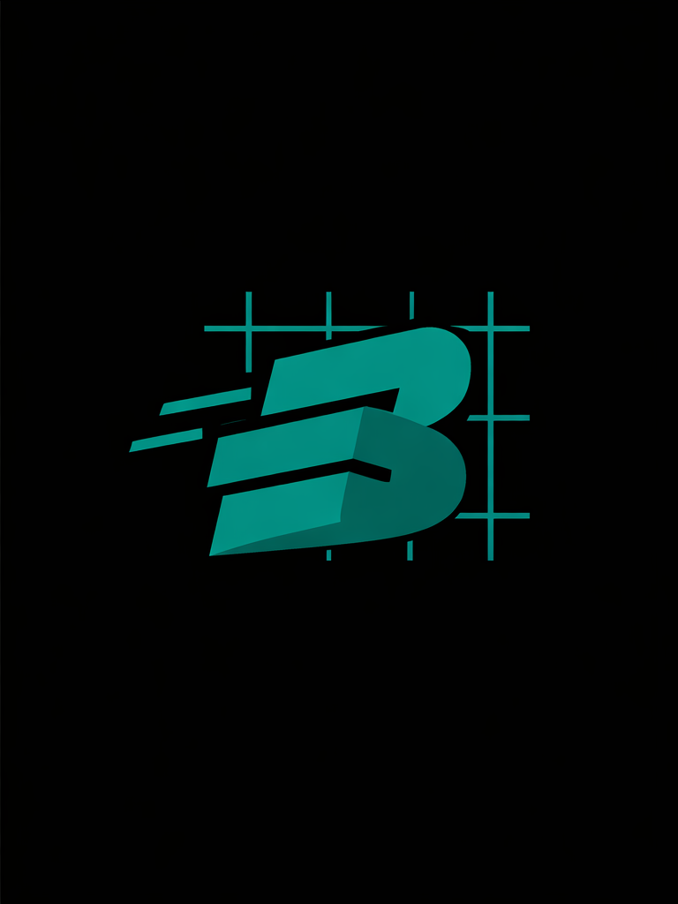
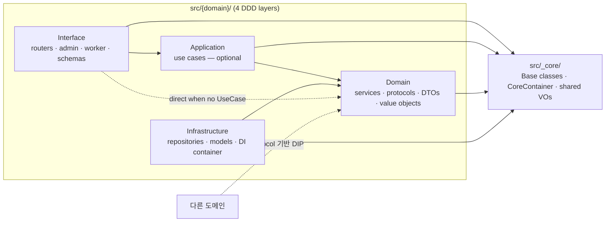
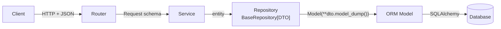

<p align="center">
  <picture>
    <source media="(prefers-color-scheme: dark)" srcset="assets/logo-dark.png">
    <source media="(prefers-color-scheme: light)" srcset="assets/logo-light.png">
    
  </picture>
</p>

<h1 align="center">FastAPI Agent Blueprint</h1>

<p align="center">
  <a href="https://github.com/Mr-DooSun/fastapi-agent-blueprint/actions/workflows/ci.yml"></a>
  <a href="https://www.python.org/downloads/"></a>
  <a href="https://fastapi.tiangolo.com"></a>
  <a href="../LICENSE"></a>
  <a href="https://github.com/astral-sh/ruff"></a>
  <a href="https://github.com/Mr-DooSun/fastapi-agent-blueprint/stargazers"></a>
</p>

<p align="center">
  <b>AI 에이전트 백엔드를 위한 프로덕션 지향 FastAPI 블루프린트.</b><br>
  DDD 레이어 · 보일러플레이트 제로 CRUD · 도메인 자동 발견 · 멀티 인터페이스 (API · Worker · Admin · MCP 준비) ·<br>
  벡터 / 임베딩 / LLM 인프라 · Claude Code &amp; Codex CLI용 AI 개발 스킬 내장.
</p>

<p align="center">
  <a href="#60초-만에-실행">60초 만에 실행</a>
  · <a href="#한눈에-보는-아키텍처">아키텍처</a>
  · <a href="#ai-네이티브-개발">AI 스킬</a>
  · <a href="#비교">비교</a>
  · <a href="../README.md">English</a>
</p>

<p align="center">
  <a href="https://github.com/Mr-DooSun/fastapi-agent-blueprint/generate">
    
  </a>
</p>

---

## 60초 만에 실행

Docker · PostgreSQL · 클라우드 자격 증명 모두 불필요 — SQLite + In-Memory 브로커.

```bash
git clone https://github.com/Mr-DooSun/fastapi-agent-blueprint.git
cd fastapi-agent-blueprint
make setup        # 최초 1회: uv 로 venv + 의존성 설치
make quickstart   # :8001 에 FastAPI 기동, SQLite 스키마 자동 생성
```

다른 터미널에서 `make demo` 로 `user` 도메인을 `curl` 로 왕복해봅니다:

```text
→ Health check
{ "status": "ok" }

→ Create a user
{ "success": true, "data": { "id": 1, "username": "alice",
                             "fullName": "Alice Liddell", ... } }

→ List users (page=1, pageSize=10)
{ "data": [ { "id": 1, "username": "alice", ... } ],
  "pagination": { "currentPage": 1, "totalItems": 1,
                  "hasNext": false, ... } }

→ Update the user    → Delete the user
→ Done. API docs: http://127.0.0.1:8001/docs
```

- API 문서: <http://127.0.0.1:8001/docs> (Stoplight Elements / Scalar 추천; 같은 페이지에 spec download + 프론트엔드 핸드오프 링크)
- Admin UI: <http://127.0.0.1:8001/admin> (`admin` / `admin`)
- 전체 안내: [`docs/quickstart.md`](quickstart.md)
- 프론트엔드 핸드오프: [`docs/frontend-handoff.md`](frontend-handoff.md)
- 실제 개발 환경 (PostgreSQL + 마이그레이션): [`docs/reference.md`](reference.md#local-development-with-postgresql)

---

## 왜 이 블루프린트인가

- **도메인 로직을 한 번만 쓰고, 어디서든 노출.** HTTP (FastAPI) + Worker (Taskiq) + Admin (NiceGUI) 가 하나의 Domain 레이어를 공유합니다. MCP 서버는 로드맵에 있음.
- **보일러플레이트 제로 CRUD.** `BaseRepository[DTO]` 와 `BaseService[Create, Update, DTO]` 를 상속하면 `QueryFilter` 기반 페이징 목록을 포함한 8개 async 메서드를 즉시 확보.
- **도메인 자동 발견.** `src/{name}/` 에 폴더 하나만 두면 자동 등록. Container 수정도, bootstrap 수정도 필요 없음.
- **환경변수 한 줄로 교체 가능한 인프라.** PostgreSQL / MySQL / SQLite · DynamoDB · S3 / MinIO · S3 Vectors · SQS / RabbitMQ / InMemory · LLM/Embedding 모두 OpenAI / Bedrock.
- **커밋 시점에 아키텍처 강제.** Pre-commit 훅이 `Domain → Infrastructure` import 를 차단하여 DDD 계약이 썩지 않도록 보장.
- **AI 네이티브 워크플로우.** Claude Code 14개 + Codex CLI 14개 스킬이 동일한 `AGENTS.md` 규칙을 공유 — 한 줄로 도메인 스캐폴딩, 라우트 추가, 아키텍처 감사가 가능.

---

## 비교

| 기능 | FastAPI Agent Blueprint | [tiangolo/full-stack](https://github.com/fastapi/full-stack-fastapi-template) | [s3rius/template](https://github.com/s3rius/FastAPI-template) | [teamhide/boilerplate](https://github.com/teamhide/fastapi-boilerplate) |
|---|:-:|:-:|:-:|:-:|
| 보일러플레이트 제로 CRUD (8개 메서드) | **Yes** | No | No | No |
| 도메인 자동 발견 | **Yes** | No | No | No |
| 아키텍처 자동 강제 (pre-commit) | **Yes** | No | No | No |
| AI 워크플로우 스킬 (Claude + Codex) | **14 + 14** | 0 | 0 | 0 |
| 벡터 인프라 (S3 Vectors) | **Yes** | No | No | No |
| 멀티 인터페이스 (API + Worker + Admin + MCP) | **3 + 1 예정** | 2 | 1 | 1 |
| Architecture Decision Records | **18 active · 30 archived** | 0 | 0 | 0 |
| 전 계층 타입 안전 제네릭 | **Yes** | 부분 | 부분 | No |
| IoC Container DI | **Yes** | No | No | No |

---

## 한눈에 보는 아키텍처

`src/{domain}/` 아래의 모든 도메인은 4개의 DDD 레이어를 가집니다. 화살표는
**"의존한다"** 방향. `Application` (use case) 은 선택 사항이며, 단순 CRUD 는
점선 경로 (Router → Service 직접 연결) 를 사용합니다.



| 계층 | 역할 | Base 클래스 |
|---|---|---|
| Interface | Router · Request/Response · Admin · Worker task | — |
| Domain | Service · Protocol · DTO · Exceptions | `BaseService[CreateDTO, UpdateDTO, ReturnDTO]` |
| Infrastructure | Repository · Model · DI container | `BaseRepository[ReturnDTO]` |
| Application | UseCase — 선택적 오케스트레이터 | — |

> Layer · Write · Read 다이어그램 전체와 RDB / DynamoDB / S3 Vectors
> 변종 표는
> [`docs/ai/shared/architecture-diagrams.md`](ai/shared/architecture-diagrams.md)
> 에 있습니다. Mermaid 가 렌더되지 않는 뷰어용 SVG export:
> [`docs/assets/architecture/`](assets/architecture/).

### 데이터 흐름 — Write (`POST` / `PUT` / `DELETE`)



- 필드가 일치하면 **Request 를 Service 로 그대로 전달** — 중간 DTO 불필요 ([ADR 004](history/004-dto-entity-responsibility.md))
- **Model ↔ DTO 변환은 Repository 안에서만** 발생
- Read 흐름은 대칭이며, 민감 필드는 Router 가 응답으로 내보내기 직전에 제거

### 저장소 변종

흐름 형태는 동일하고 Base 클래스와 영속 객체만 바뀝니다.

| 저장소 | Service base | Repository / Store base | 리스트 반환 |
|---|---|---|---|
| RDB (기본) | `BaseService[Create, Update, DTO]` | `BaseRepository[DTO]` | `(list[DTO], PaginationInfo)` |
| DynamoDB | `BaseDynamoService[…]` | `BaseDynamoRepository[DTO]` | `CursorPage[DTO]` |
| S3 Vectors | 도메인별 구현 | `BaseS3VectorStore[DTO]` | `VectorSearchResult[DTO]` |

---

## 인터페이스

하나의 비즈니스 로직을 여러 표면으로 노출:

| 인터페이스 | 기술 | 상태 | 용도 |
|---|---|---|---|
| HTTP API | FastAPI | Stable | REST 엔드포인트 |
| 비동기 Worker | Taskiq + SQS / RabbitMQ / InMemory | Stable | 백그라운드 작업 |
| Admin UI | NiceGUI | Stable | 자동 생성 admin CRUD |
| MCP server | FastMCP | Planned ([#18](https://github.com/Mr-DooSun/fastapi-agent-blueprint/issues/18)) | AI 에이전트 도구 인터페이스 |

---

## AI 네이티브 개발

**Claude Code** 와 **OpenAI Codex CLI** 둘 다 일급 지원. 하나의 규칙
파일 ([`AGENTS.md`](../AGENTS.md)) 과 하나의 workflow 레퍼런스 레이어
([`docs/ai/shared/`](ai/shared/)) 를 공유하고, 도구별 하네스가 그 위에
얹힙니다.

| | Claude Code | Codex CLI |
|---|---|---|
| 스킬 | 14개 slash 커맨드 (`.claude/skills/`) | 15개 workflow 스킬 (`.agents/skills/`) |
| 설정 | `CLAUDE.md` + `.mcp.json` | `.codex/config.toml` + `.codex/hooks.json` |
| 훅 | PostToolUse 자동 포맷 | 6개 훅 (format · security · session-start · …) |

### 10분 안에 첫 도메인 만들기

```text
/onboard            # 수준별 적응형 온보딩 (초급 ~ 고급)
/new-domain product # 15개 소스 파일 + 25개 __init__.py + 4개 테스트 생성
/add-api "add GET /product/top-selling to product"
/review-architecture product
```

Codex CLI 를 쓴다면 `/` 대신 `$`. 하네스 없이 손으로 만들고 싶다면
[**"10분 안에 첫 도메인" 튜토리얼**](tutorial/first-domain.md) 이 두 경로를
나란히 보여줍니다 — 스킬 한 줄 vs. Python 파일 9개 — 마지막엔 `pytest`
통과 + 실제 서버에 `curl` 까지 완주.

두 도구에서 모두 동작하는 주요 스킬: `onboard`, `new-domain`, `add-api`,
`add-worker-task`, `add-admin-page`, `review-architecture`,
`security-review`, `review-pr`, `plan-feature`, `fix-bug`. 전체 표와
설치 가이드: [`docs/ai-development.ko.md`](ai-development.ko.md).

---

## 더 읽을거리

| 원하는 것 | 읽을 곳 |
|---|---|
| 일단 띄워보기 | [`docs/quickstart.md`](quickstart.md) |
| 도메인 하나 end-to-end 로 만들기 | [`docs/tutorial/first-domain.md`](tutorial/first-domain.md) |
| 작은 패턴 중심 예제 앱 둘러보기 | [`examples/`](../examples/) |
| 아키텍처를 깊이 이해 | [`docs/ai/shared/architecture-diagrams.md`](ai/shared/architecture-diagrams.md) · [`AGENTS.md`](../AGENTS.md) |
| Claude Code / Codex CLI 설정 | [`docs/ai-development.ko.md`](ai-development.ko.md) |
| 도메인을 수동으로 추가 (AI 도구 없이) | [`docs/tutorial/first-domain.md`](tutorial/first-domain.md) (Path B) |
| 상세 env 변수 · 기술 스택 · 프로젝트 트리 | [`docs/reference.md`](reference.md) |
| 어떤 결정을 왜 했는지 | [ADR 인덱스](history/README.md) (18 active · 30 archived) |
| 다음 계획 | [Roadmap](reference.md#roadmap) · [이슈 트래커](https://github.com/Mr-DooSun/fastapi-agent-blueprint/issues) |

---

## 로드맵

- **MCP 서버 인터페이스** — FastMCP 로 도메인 서비스를 에이전트 도구로 노출 ([#18](https://github.com/Mr-DooSun/fastapi-agent-blueprint/issues/18))
- **pgvector** — S3 Vectors 와 병행할 추가 벡터 백엔드 ([#11](https://github.com/Mr-DooSun/fastapi-agent-blueprint/issues/11))

전체 로드맵: [docs/reference.md#roadmap](reference.md#roadmap) · [이슈 트래커](https://github.com/Mr-DooSun/fastapi-agent-blueprint/issues)

---

## Contributing

개발 환경 설정, 코딩 가이드라인, PR 워크플로우는
[`CONTRIBUTING.md`](../CONTRIBUTING.md) 를 참고하세요. 새로 오신 분은
[`good first issue`](https://github.com/Mr-DooSun/fastapi-agent-blueprint/issues?q=is%3Aopen+label%3A%22good+first+issue%22)
라벨을 먼저 확인해주세요. [`examples/`](../examples/) 아래 작은 예제
앱들이 첫 PR을 내기 좋은 저마찰 진입점입니다.

## License

[MIT](../LICENSE) — 상업적 사용, 수정, 재배포 자유.

---

<p align="center">
<a href="https://star-history.com/#Mr-DooSun/fastapi-agent-blueprint&Date">
  <picture>
    <source media="(prefers-color-scheme: dark)" srcset="https://api.star-history.com/svg?repos=Mr-DooSun/fastapi-agent-blueprint&type=Date&theme=dark" />
    <source media="(prefers-color-scheme: light)" srcset="https://api.star-history.com/svg?repos=Mr-DooSun/fastapi-agent-blueprint&type=Date" />
    
  </picture>
</a>
</p>
