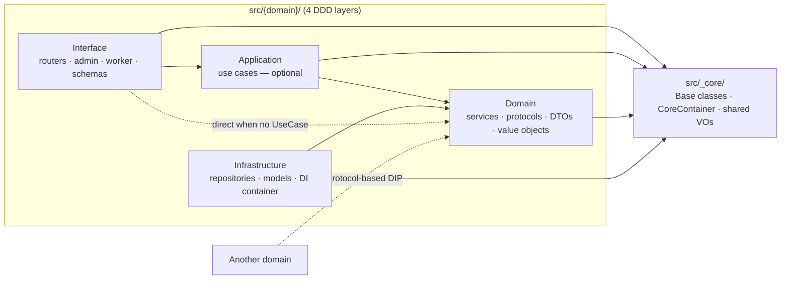

<p align="center">
  <picture>
    <source media="(prefers-color-scheme: dark)" srcset="assets/logo-dark.png">
    <source media="(prefers-color-scheme: light)" srcset="assets/logo-light.png">
    
  </picture>
</p>

<h1 align="center">FastAPI Agent Blueprint</h1>

<p align="center">
  <a href="https://github.com/Mr-DooSun/fastapi-agent-blueprint/actions/workflows/ci.yml"></a>
  <a href="https://www.python.org/downloads/"></a>
  <a href="https://fastapi.tiangolo.com"></a>
  <a href="../LICENSE"></a>
  <a href="https://github.com/astral-sh/ruff"></a>
  <a href="https://github.com/Mr-DooSun/fastapi-agent-blueprint/stargazers"></a>
</p>

<p align="center">
  <b>팀이 AI 코딩 에이전트와 함께 개발하는 FastAPI 백엔드 블루프린트.</b><br>
  애플리케이션을 실행할 모듈형 백엔드와, 팀의 개발 과정을 안내하는 공통 협업 하네스를 제공합니다.
</p>

<p align="center">
  <a href="#빠르게-실행하기">백엔드 실행하기</a>
  · <a href="#ai-협업-하네스">하네스 살펴보기</a>
  · <a href="#왜-이-블루프린트인가">나에게 적합한가?</a>
  · <a href="../README.md">English</a>
</p>

<p align="center">
  <a href="https://github.com/Mr-DooSun/fastapi-agent-blueprint/generate">
    
  </a>
</p>

| 백엔드 기반 | AI 협업 하네스 |
|---|---|
| HTTP API·백그라운드 작업·관리자 화면이 도메인 로직을 공유합니다. AI와 외부 인프라는 선택적으로 연결하므로 로컬에서 시작해 필요한 서비스를 추가할 수 있습니다. | 저장소 규칙·작업별 스킬·훅·리뷰 절차가 Claude Code·Codex·Antigravity에서 이 백엔드를 변경하는 과정을 안내합니다. |
| [로컬 실행](#빠르게-실행하기) · [아키텍처](#한눈에-보는-아키텍처) | [API 변경 사례](#ai-협업-하네스) · [공유 워크플로](ai/shared/target-operating-model.md) |

## 왜 이 블루프린트인가

여러 비즈니스 도메인, API·워커·관리자 화면, 또는 AI 코딩 도구를 함께 쓰는
팀의 공통 개발 절차가 필요할 때 적합합니다. 백엔드와 하네스는 함께 설계됐으며,
하네스는 이 저장소의 계층 구조·계약·검증 명령을 참조합니다.

도메인 구조, dependency-injector 컨테이너, 계획·리뷰 절차를 익힐 시간이 필요합니다.
작은 단일 목적 API에는 이 구조가 과할 수 있고, 고객용 프런트엔드까지 포함된
스타터를 원한다면 다른 출발점이 필요합니다. 하네스는 이 저장소에 맞춰져 있으며
별도로 가져다 쓰는 범용 패키지는 아닙니다.

AI 도구 없이도 [수동 도메인 작성 튜토리얼](tutorial/first-domain.md)로 개발할 수 있습니다.
점진적 도입과 비용은 [도입 가이드](adoption.md)와 [선택 가이드](comparison.md)를 참고하세요.

<a id="60초-만에-실행"></a>

## 빠르게 실행하기

Python **>=3.12.9**, [uv](https://docs.astral.sh/uv/), Git, `make`가 필요합니다.
데모는 PATH에 있는 `curl`과 `python3`도 사용합니다.
Docker·PostgreSQL·클라우드 자격 증명·AI 코딩 도구는 필요하지 않습니다.

**터미널 1 — 백엔드 실행:**

```bash
git clone https://github.com/Mr-DooSun/fastapi-agent-blueprint.git
cd fastapi-agent-blueprint
make quickstart
```

체험용 의존성을 설치하고 SQLite DB를 만든 뒤 8001 포트에서 서버를 계속 실행합니다.
체험은 새 체크아웃에서 시작하세요. `quickstart`는 admin extra를 동기화하면서 기존에
설치한 다른 extra를 제거할 수 있습니다. [개발 환경](reference.md#local-development-with-postgresql)으로
전환할 때 `make setup`으로 개발 의존성과 커밋 훅을 설치합니다.

**터미널 2 — 같은 저장소 디렉터리에서 실행:**

```bash
make demo       # JWT 인증, 관리자 realm 로그인, 사용자 CRUD, 갱신과 로그아웃
make demo-rag   # 문서 업로드, 검색, 출처를 포함한 답변
```

터미널 1의 서버는 계속 켜 둡니다. 두 데모는 API 응답을 검사하고 요청이 성공하지
않으면 실패를 보고합니다. 기본 RAG 데모는 키워드 기반 stub 임베더와 템플릿형 stub
답변 에이전트를 사용하므로 외부 모델을 호출하지 않고 파이프라인을 확인할 수 있습니다.

- [API 문서](http://127.0.0.1:8001/docs) — API 탐색과 OpenAPI 명세 다운로드.
- [관리자 UI](http://127.0.0.1:8001/admin) — 체험용 초기 로그인: `admin` / `admin`.
- [Quickstart 상세](quickstart.md) · [전체 통합 시연](canonical-demo.md).

이 기본값은 로컬 체험용입니다. 실제 데이터를 다루거나 서비스를 외부에 공개하기
전에는 개발·배포 가이드를 따라 설정해야 합니다.


## 백엔드 기반

| 기능 | 제공하는 것 |
|---|---|
| 도메인 구조 | Router → Service → Repository와 조합 로직을 위한 선택적 UseCase. 도메인 자동 등록과 재사용 가능한 CRUD 기반 클래스. |
| API·워커·관리자 | 도메인 서비스를 사용하는 FastAPI 엔드포인트, Taskiq 작업, NiceGUI 관리자 페이지. |
| 선택적 인프라 | 어댑터와 설정으로 연결하는 SQL DB·DynamoDB·객체 저장소·벡터 저장소·AI 공급자. SQLite + InMemory로 시작 가능. |
| 운영 | JWT/RBAC, 구조화 로그, 선택적 OpenTelemetry, AI 사용량 기록, 오류 알림. |

### 실제 사례: 문서 질의응답

`docs` 도메인은 문서 업로드·청킹·임베딩·검색·출처가 있는 답변을 연결합니다.
공유 RAG 파이프라인은 다른 도메인에서도 재사용할 수 있습니다
([ADR 040](history/040-rag-as-reusable-pattern.md)).

실제 모델을 호출하려면 `pydantic-ai` extra를 설치하고,
`EMBEDDING_PROVIDER` + `EMBEDDING_MODEL`, `LLM_PROVIDER` + `LLM_MODEL`,
선택한 공급자의 자격 증명을 설정합니다.
선택적 extra와 설정은 [설정 레퍼런스](reference.md), 전체 흐름은
[RAG 시연](canonical-demo.md)을 참고하세요.

<a id="인터페이스"></a>

HTTP·워커·관리자 인터페이스는 구현돼 있습니다. MCP 서버 인터페이스는
[예정 기능](https://github.com/Mr-DooSun/fastapi-agent-blueprint/issues/18)이며
현재 실행 가능한 백엔드에는 포함되지 않습니다.

<a id="ai-네이티브-개발"></a>

## AI 협업 하네스

하네스는 기여자가 같은 백엔드 규칙에 따라 작업하도록 돕습니다.

| 기능 | 제공하는 것 |
|---|---|
| 공통 규칙 | `AGENTS.md`와 공유 레퍼런스에 정의된 아키텍처·계약·보안 제약·개발 절차. |
| 작업별 스킬 | 도메인·API·워커·관리자 페이지·마이그레이션·테스트·리뷰·문서 동기화 가이드. |
| 작업 단계 구분 | 계획과 실행을 분리하고, 범위 변경·검증 누락·완료 확인을 명시적으로 다루는 절차. |
| 검사와 리뷰 | 확정적으로 판별 가능한 규칙을 검사하는 커밋/CI 검사와, 동작·아키텍처 적합성·문서 불일치를 살피는 리뷰. |

### 실제 작업 흐름: 기존 도메인에 API 추가

“order 도메인에 필터링 가능한 목록 API를 추가한다”는 요청을 예로 들면 다음과 같습니다.

| 단계 | 기여자와 에이전트가 하는 일 |
|---|---|
| 문제 정의와 계획 | `/plan-feature`(Claude) 또는 `$plan-feature`(Codex)로 계약과 영향받는 계층을 구체화하고 실행 계획을 검토합니다. |
| 실행 시작 | 기여자가 계획을 지정해 `/execute-plan` 또는 `$execute-plan`을 명시적으로 호출합니다. 실행기는 API 구현을 `add-api` 스킬로 연결합니다. |
| 구현과 검증 | 기존 계층 패턴을 활용하고 관련 테스트를 추가한 뒤 계획의 검증 명령을 실행합니다. 계획에 없던 기능이 필요하면 작업 범위를 넓히기 전에 알립니다. |
| 리뷰와 동기화 | 변경을 리뷰하고, 필요한 경우 `sync-guidelines`로 관련 문서를 맞춥니다. 검증 결과와 미해결 사항을 기록한 뒤 PR 완료를 판단합니다. |

이 표는 작업 흐름 예시이며 모든 단계를 자동 실행하는 명령이 아닙니다.
사람의 판단은 과정에 계속 포함됩니다.

**무엇을 강제하나요?** 설정된 pre-commit/CI 검사는 금지된 import, 깨진 문서 링크,
공유 파일의 언어 정책 위반 등을 발견하면 차단합니다. 작업 절차 안내는 권고인 경우가
많습니다. 예를 들어 계획→실행 게이트는 Claude에서 조건에 맞는 소스 편집을 차단하지만,
Codex에서는 Stop 시점에 안내합니다. 도구별 어댑터는 정책을 공유하지만 강제 수준은
동일하지 않습니다. 현재 적용 범위와 예외는 [운영 모델](ai/shared/target-operating-model.md)을 참고하세요.

<a id="10분-안에-첫-도메인-만들기"></a>

도메인 스캐폴딩도 지원하는 작업 중 하나입니다.


[Claude Code·Codex 설정](ai-development.md) ·
[Antigravity 하네스](../.antigravity/rules/project-harness.md) ·
[공통 규칙](../AGENTS.md) ·
[수동 개발 경로](tutorial/first-domain.md)

## 한눈에 보는 아키텍처

도메인은 Interface·Domain·Infrastructure와 선택적 Application으로 나뉩니다.
일반 CRUD의 실행 흐름은 Router → Service → Repository입니다.
아래 화살표는 요청 처리 순서가 아닌 코드의 의존 방향을 나타냅니다.


```mermaid
flowchart LR
    subgraph domain["src/{domain}/  (4 DDD layers)"]
        I["Interface<br/>routers · admin · worker · schemas"]
        A["Application<br/>use cases — optional"]
        D["Domain<br/>services · protocols · DTOs · value objects"]
        Inf["Infrastructure<br/>repositories · models · DI container"]
        I --> A
        A --> D
        Inf --> D
        I -. direct when no UseCase .-> D
    end

    Core["src/_core/<br/>Base classes · CoreContainer · shared VOs"]
    I --> Core
    A --> Core
    D --> Core
    Inf --> Core

    Other["Another domain"] -. via Protocol-based DIP .-> D
```

<a id="데이터-흐름--write-post--put--delete"></a>
<a id="저장소-변종"></a>

필드가 같으면 Request 스키마를 Service에 직접 전달합니다. Model과 DTO의 변환은
Repository가 담당합니다. 상세 읽기·쓰기 흐름과 저장소별 구조는
[아키텍처 가이드](ai/shared/architecture-diagrams.md)
([SVG 버전](assets/architecture/))에 있습니다.

<a id="비교"></a>

## 더 읽을거리

| 백엔드 개발 | AI 협업 |
|---|---|
| [Quickstart](quickstart.md) · [통합 시연](canonical-demo.md) | [도구 설정](ai-development.md) · [Antigravity](../.antigravity/rules/project-harness.md) |
| [첫 도메인 튜토리얼](tutorial/first-domain.md) · [예제](../examples/) | [공통 규칙](../AGENTS.md) · [워크플로와 예외](ai/shared/target-operating-model.md) |
| [도입 방법](adoption.md) · [선택 기준](comparison.md) | [설계 결정](history/README.md) |
| [설정](reference.md) · [호환성](compatibility.md) · [프런트엔드 협업](frontend-handoff.md) | [기여·리뷰 절차](../CONTRIBUTING.md) |

## 로드맵

- [MCP 서버 인터페이스](https://github.com/Mr-DooSun/fastapi-agent-blueprint/issues/18).
- [pgvector 백엔드](https://github.com/Mr-DooSun/fastapi-agent-blueprint/issues/11).

[전체 로드맵](reference.md#roadmap)과
[이슈 목록](https://github.com/Mr-DooSun/fastapi-agent-blueprint/issues)을 참고하세요.

## Contributing

개발 환경과 PR 절차는 [CONTRIBUTING.md](../CONTRIBUTING.md)를 참고하세요.
[예제](../examples/)와
[good first issue](https://github.com/Mr-DooSun/fastapi-agent-blueprint/issues?q=is%3Aopen+label%3A%22good+first+issue%22)에서
첫 기여를 시작할 수 있습니다.

## License

[MIT](../LICENSE) — 상업적 사용·수정·배포가 가능합니다.

---

<p align="center">
<a href="https://star-history.com/#Mr-DooSun/fastapi-agent-blueprint&Date">
  <picture>
    <source media="(prefers-color-scheme: dark)" srcset="https://api.star-history.com/svg?repos=Mr-DooSun/fastapi-agent-blueprint&type=Date&theme=dark" />
    <source media="(prefers-color-scheme: light)" srcset="https://api.star-history.com/svg?repos=Mr-DooSun/fastapi-agent-blueprint&type=Date" />
    
  </picture>
</a>
</p>
